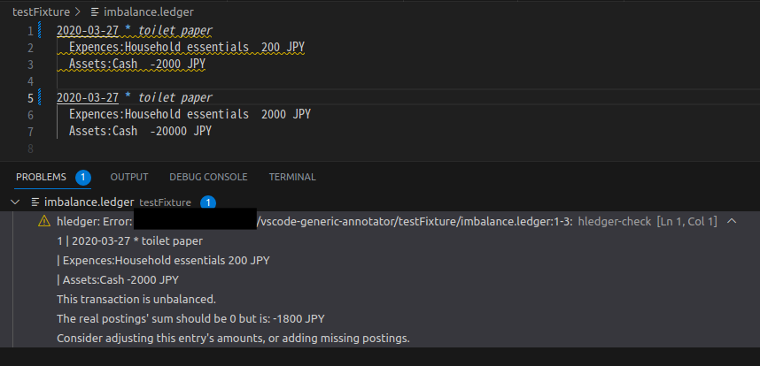
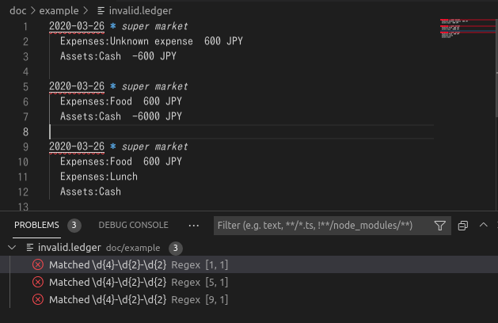
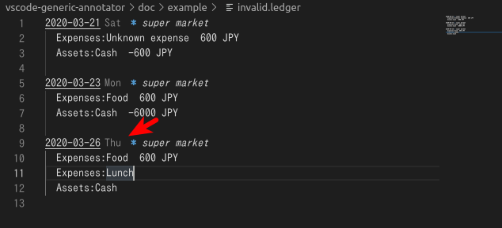

# vscode-generic-annotator

VS Code extension for linters

## Usage examples

### hledger-check

See <https://hledger.org/1.30/hledger.html#check>

Here is the output of `hledger check`:

```
$ hledger check balancednoautoconversion -f testFixture/imbalance.ledger
hledger: Error: /path/to/vscode-generic-annotator/testFixture/imbalance.ledger:1-3:
1 | 2020-03-26 * toilet paper
  |     Expences:Household essentials         200 JPY
  |     Assets:Cash                         -2000 JPY

This transaction is unbalanced.
The real postings' sum should be 0 but is: -1800 JPY
Consider adjusting this entry's amounts, or adding missing postings.
```

Wrap this output using some script (ex. hledger-check.js):

```
$ node scripts/hledger-check.js testFixture/imbalance.ledger
{"type":"diagnostic","source":"hledger-check","severity":1,"message":"hledger: Error: /path/to/vscode-generic-annotator/testFixture/imbalance.ledger:1-3:\n1 | 2020-03-26 * toilet paper\n  |     Expences:Household essentials         200 JPY\n  |     Assets:Cash                         -2000 JPY\nThis transaction is unbalanced.\nThe real postings' sum should be 0 but is: -1800 JPY\nConsider adjusting this entry's amounts, or adding missing postings.","range":{"start":{"line":0,"character":0},"end":{"line":2,"character":80}}}
```

Then, configure vscode-generic-annotator by .vscode/settings.json:

```json
{
  "genericAnnotator.annotatorConfigurations": [
    {
      "commandTemplate": "node ${workspaceRoot}/scripts/hledger-check.js ${path}",
      "pathRegex": "\\.ledger$"
    }
  ]
}
```

Finally you will get the annotations:



### Regex

See scripts/regex.js

.vscode/settings.json

```json
{
  "genericAnnotator.annotatorConfigurations": [
    {
      "commandTemplate": "node /path/to/regex.js ${path} '\\d{4}-\\d{2}-\\d{2}'",
      "pathRegex": "\\.ledger$"
    }
  ]
}
```



### Day-of-week hints

See scripts/day-of-week-hints.js

.vscode/settings.json

```json
{
  "genericAnnotator.annotatorConfigurations": [
    {
      "pathRegex": "\\.ledger$",
      "commandTemplate": "node ${workspaceRoot}/scripts/day-of-week-hints.js $(realpath --relative-to=. ${path})"
    }
  ]
}
```



## Requirement

- VS Code

## License

See the LICENSE file.

- This repository is based on
  - [lsp-sample](https://github.com/microsoft/vscode-extension-samples/tree/6f16dafc01a248ac39d450ecf56ae73274757644/lsp-sample)
  - [code-actions-sample](https://github.com/microsoft/vscode-extension-samples/tree/133fa26af64ba8760559c5a06299953673d60763/code-actions-sample)
  - [vscode-js-annotations](https://github.com/lannonbr/vscode-js-annotations)
- <div>Icons made by <a href="https://www.freepik.com" title="Freepik">Freepik</a> from <a href="https://www.flaticon.com/" title="Flaticon">www.flaticon.com</a></div>
