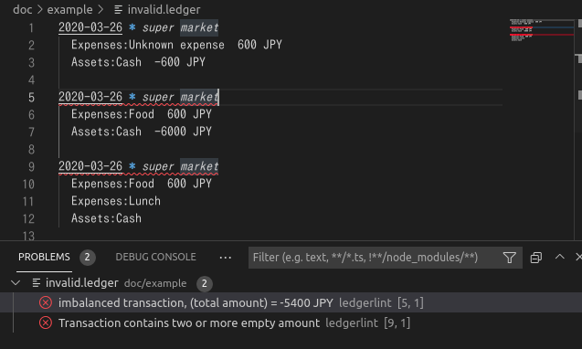
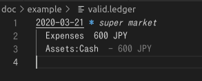

# vscode-generic-annotator

TODO

- Refactor extensions.ts

---

VS Code extension for linters

## Usage examples

### [hledger-check](https://hledger.org/1.28/hledger.html#check)

See scripts/hledger-check.js

.vscode/settings.json

```json
{
  "genericAnnotator.annotatorConfigurations": [
    {
      "commandTemplate": "node ${workspaceRoot}/scripts/hledger-check.js $(realpath --relative-to=. ${path})",
      "pathRegex": "\\.ledger$"
    }
  ]
}
```

### [ledgerlint](https://github.com/oshikiri/ledgerlint)

(deprecated) Use hledger-check instead.

.vscode/settings.json

```json
{
  "genericAnnotator.annotatorConfigurations": [
    {
      "commandTemplate": "ledgerlint -j -f $(realpath --relative-to=. ${path})",
      "pathRegex": "\\.ledger$"
    }
  ]
}
```

```console
$ ledgerlint -f doc/example/invalid.ledger -j
{"type":"diagnostic","source":"ledgerlint","file_path":"doc/example/invalid.ledger","line_number":5,"range":{"start":{"line":4,"character":0},"end":{"line":4,"character":80}},"level":"ERROR","severity":1,"message":"imbalanced transaction, (total amount) = -5400 JPY"}
{"type":"diagnostic","source":"ledgerlint","file_path":"doc/example/invalid.ledger","line_number":9,"range":{"start":{"line":8,"character":0},"end":{"line":8,"character":80}},"level":"ERROR","severity":1,"message":"Transaction contains two or more empty amount"}
```



```console
$ ledgerlint -f doc/example/valid.ledger -j
{"type":"decoration","source":"ledgerlint","file_path":"doc/example/valid.ledger","range":{"start":{"line":2,"character":0},"end":{"line":2,"character":80}},"renderOptions":{"after":{"contentText":"- 600 JPY","color":"grey","margin":"2ch"}}}
```



### Regex

See scripts/regex.js

.vscode/settings.json

```json
{
  "genericAnnotator.annotatorConfigurations": [
    {
      "commandTemplate": "node /path/to/regex.js ${path} '\\d{4}-\\d{2}-\\d{2}'",
      "pathRegex": "\\.ledger$"
    }
  ]
}
```


### Day-of-week hints

See scripts/day-of-week-hints.js

.vscode/settings.json

```json
{
  "genericAnnotator.annotatorConfigurations": [
    {
      "pathRegex": "\\.ledger$",
      "commandTemplate": "node ${workspaceRoot}/scripts/day-of-week-hints.js $(realpath --relative-to=. ${path})"
    }
  ]
}
```


## Requirement

- VS Code

## License

MIT

- This repository is based on
  - [lsp-sample](https://github.com/microsoft/vscode-extension-samples/tree/6f16dafc01a248ac39d450ecf56ae73274757644/lsp-sample)
  - [code-actions-sample](https://github.com/microsoft/vscode-extension-samples/tree/133fa26af64ba8760559c5a06299953673d60763/code-actions-sample)
  - [vscode-js-annotations](https://github.com/lannonbr/vscode-js-annotations)
- <div>Icons made by <a href="https://www.freepik.com" title="Freepik">Freepik</a> from <a href="https://www.flaticon.com/" title="Flaticon">www.flaticon.com</a></div>
